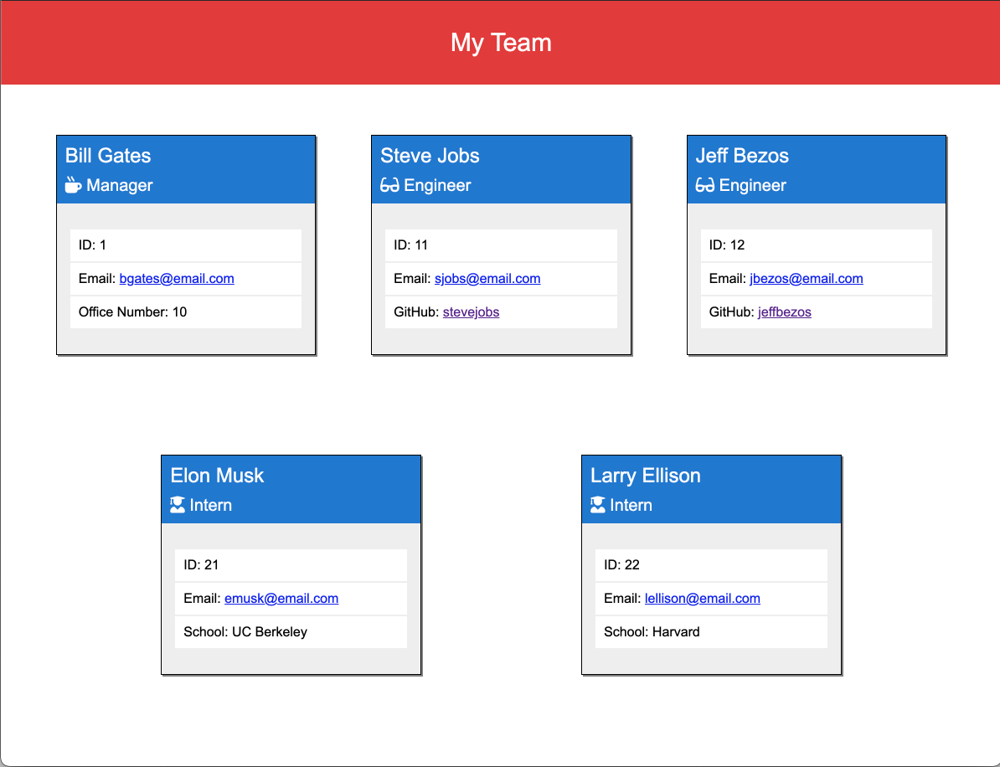

# Team Profile Generator

## Description
A node.js command-line application that takes in information about employees on a software engineering team and generates an HTML webpage that displays summaries for each person.

## Table of Contents
- [Deployment URL](#Deployment-URL)
- [Repo URL](#Repo-URL)
- [Features](#Features)
- [Pre-Requisites](#Pre-Requisites)
- [Installation](#Installation)
- [Usage](#Usage)
- [Technologies Used](#Technologies-Used)
- [Tests](#Tests)
- [Questions](#Questions)
- [License](#License)

### Deployment URL
This is a command-line application. It is not deployed online.

### Repo URL
https://github.com/ahmadelgamal/ucb-team-profile-generator

## Features
1. Easy-to-use command-line application.
1. Has built-in tests using `jest`.

## Pre-Requisites
1. Install `node.js`.

## Installation
1. Download or Clone this repository.
1. If you downloaded the zipped version of this repo, then unzip it in the desired directory.
1. Go to the command line (if you're not there already).
1. Navigate to unzipped directory.
1. Run: `npm install`.

## Usage
1. Run: `npm start` or `node index.js`.
1. Answer the prompts.
1. When finished, navigate to the `dist` folder.
1. If the app ran without errors, then you should find the `index.html` file in the `dist` folder.
1. When copying the HTML file, make sure to copy the `assets` folder, which includes the `css` styling.

### Screenshot / Gif Animation

### Video Demo
[Video Link](https://youtu.be/-MPtJeRHqgs)

## Technologies Used
1. HTML
1. CSS
1. JavaScript
1. [Node.js](https://nodejs.org/en/)
1. [Inquirer.js](https://www.npmjs.com/package/inquirer)
1. [Jest](https://www.npmjs.com/package/jest)
1. [Asciiart-logo](https://www.npmjs.com/package/asciiart-logo)

## Tests
This app has 4 tests, one for each `class`, using `jest`. To run the tests type the command `npm run test` in the command line.

## Questions
Please send your questions and / or comments to **Ahmad El Gamal** at ahmadelgamal@gmail.com, or contact me on [GitHub](https://github.com/ahmadelgamal).

## License
This project is licensed under the terms of the [MIT](https://opensource.org/licenses/MIT) license.
